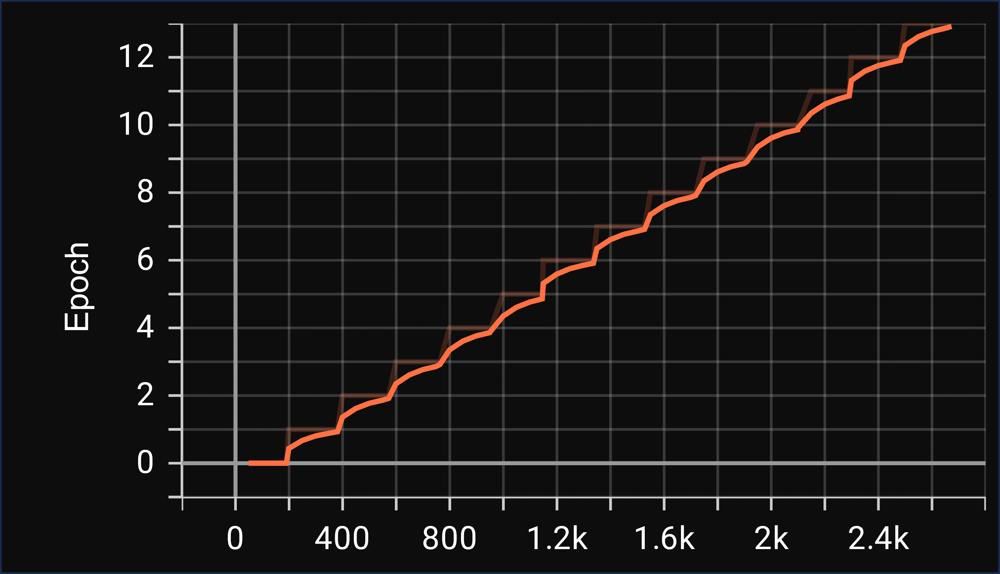
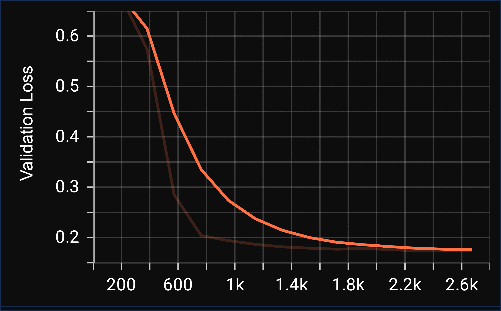

### Description

This project approaches the task of multi-labeltext classification from two different perspectives. The first approach is based on the traditional machine learning techniques and the second approach is based on deep learning techniques.

The traditional machine learning techniques used are:
- Logistic Regression
- Naive Bayes

The deep learning techniques used are:
- Fine tuning a pretrained RoBERTa model and then using it for classification

The dataset used for this project is available on [Kaggle](https://www.kaggle.com/c/jigsaw-toxic-comment-classification-challenge/data).

The dataset contains 159571 comments which are classified into six categories: toxic, severe_toxic, obscene, threat, insult, identity_hate.

The dataset is highly imbalanced. The following table shows the number of comments in each category.

| Category | Number of comments |
| --- | --- |
| Toxic | 15294 |
| Severe Toxic | 1595 |
| Obscene | 8449 |
| Threat | 478 |
| Insult | 7877 |
| Identity Hate | 1405 |

The dataset is first balanced by sampling the comments from the clean category to equal the number of toxic comments. Then, the balanced dataset is split into train and test sets. The train set contains 24337 comments and the test set contains 8113 comments.

Pytorch lightning is used for training the models since it provides a high level interface for Pytorch. It also provides a lot of useful features like automatic checkpointing, automatic logging, automatic gradient accumulation, etc.

The models are trained on Google Colab. Measured training runtime for the RoBERTa model was: 1h 8m 31s on a Tesla T4 GPU.

The figures below show the epochs, training loss, validation loss on the train and validation sets for the RoBERTa model as displayed on the pytorch lightning tensor board.

*Epochs:*

*Training Loss:*

*Validation Loss:*

### Results

The following table shows the results obtained on the test set. The results are obtained by averaging the results obtained on each category using the F1-score metric.

Categories | Naive Bayes | Logistic Regression | RoBERTa
--- | --- | --- | ---
Toxic | 0.841 | 0.858 | 0.91
Severe Toxic | 0.0 | 0.334 | 0.35
Obscene | 0.549 | 0.770 | 0.83
Threat | 0.0 | 0.165 | 0.00
Insult | 0.396 | 0.646 | 0.75
Identity Hate | 0.0 | 0.271 | 0.00

If we look at the results obtained on each category, we can see that the results obtained by using the RoBERTa model are better than the results obtained by using the traditional machine learning techniques.

The following figure shows the AUROC curve obtained on the test set by using the RoBERTa model. The curve is obtained by averaging the AUROC curves obtained on each category. It shows that the model is able to classify the comments into different categories with high accuracy. The model performs best on the toxic category and worst on the threat and identity hate categories.

### References

- [BERT](https://arxiv.org/abs/1810.04805)
- [Pytorch Lightning](https://pytorch-lightning.readthedocs.io/en/latest/)
- [Hugging Face Transformers](https://huggingface.co/transformers/)
- [Kaggle Toxic Comment Classification Challenge](https://www.kaggle.com/c/jigsaw-toxic-comment-classification-challenge/data)

### Future Work

- Use other deep learning models like CNN, LSTM, etc.
- Use other pretrained models like XLNet, etc.
- Use other machine learning models like SVM, etc.
- Use other machine learning techniques like Word2Vec, etc.
- Use other metrics like precision, recall, etc.
- Use other datasets like [Wikipedia Talk Labels: Toxicity](https://figshare.com/articles/dataset/Wikipedia_Talk_Labels_Toxicity/4563973), [Wikipedia Talk Labels: Personal Attacks](https://figshare.com/articles/dataset/Wikipedia_Talk_Labels_Personal_Attacks/4054689), etc.

